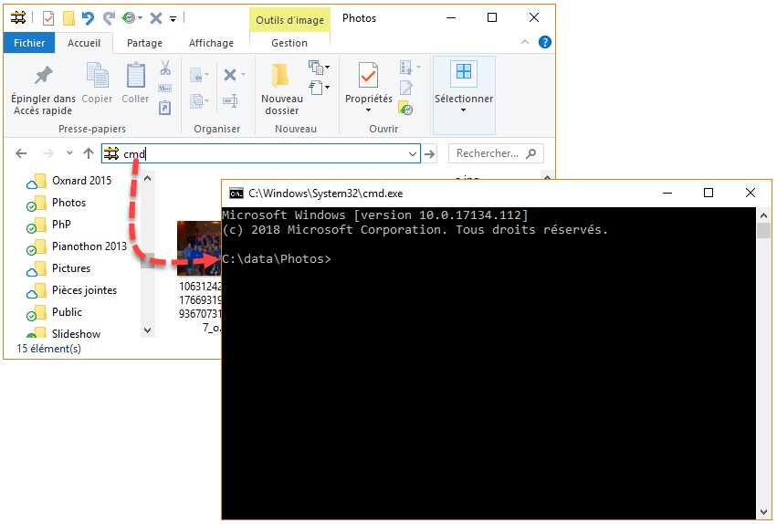

# Guide d'installation et d'exécution d'un script Python sous Windows

## Prérequis

- **Système d'exploitation** : Windows
- **Accès internet** : pour télécharger Python et les bibliothèques nécessaires.

---

## Composition

<pre>
projet/
├── Dossier_a_editer\  (pas obligé d'être dans le dossier projet)
├── rename.py
├── Readme.md
└── requirements.txt
</pre>


---

## Étapes d'installation

suivre les étapes 1 à 5 la première fois puis juste l'étape 4 ens
---

### 1. Installer Python

1. Rendez-vous sur le site officiel de Python : [https://www.python.org/downloads/](https://www.python.org/downloads/).
2. Téléchargez la version adaptée à votre système d'exploitation (recommandée : dernière version stable).
3. Lancez l'installateur téléchargé.
4. Lors de l'installation :
   - **Cochez la case** `Add Python to PATH` pour que Python soit accessible depuis la ligne de commande.
   - Cliquez sur `Install Now` ou `Customize Installation` pour configurer l'installation selon vos besoins.

### 2. Ouvrir l'invite de commandes (CMD)

1. Accédez au dossier `Projet` depuis l'explorateur de fichiers windows.
2. Cliquez dans la barre d'adresse de l'explorateur et tapez `cmd`, puis appuyez sur `Entrée`.


3. Vérifiez que Python est installé en tapant dans l'invite de commandes :
```bash
python3 --version
```
Vous devriez voir une version comme Python 3.x.x

Ainsi que pipe
```bash
pip --version
```

### 4. Telecharger le projet

1. [https://github.com/Arviscube/renameSoundFile](https://github.com/Arviscube/renameSoundFile)

2. `code`

3. `Download ZIP`

### 5. Installer les libs

Toujours dans CMD dans le dossier Projet

```bash
pip install -r requirements.txt
```


### 6. Exécuter le script Python

Ouvrir CMD dans le dossier Projet


```bash
python3 rename.py Dossier_a_editer
```

ou

```bash
python3 rename.py Chemin/vers/le/Dossier_a_editer
```
